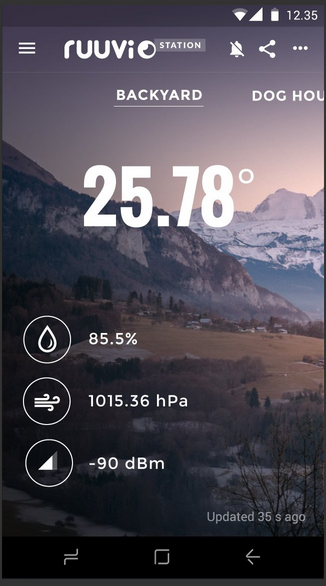
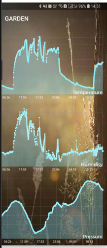
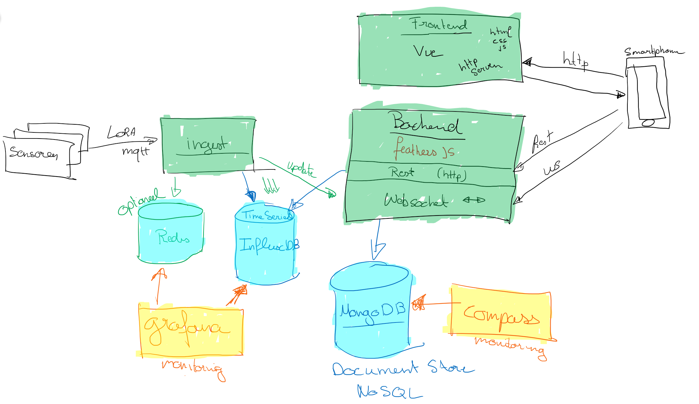
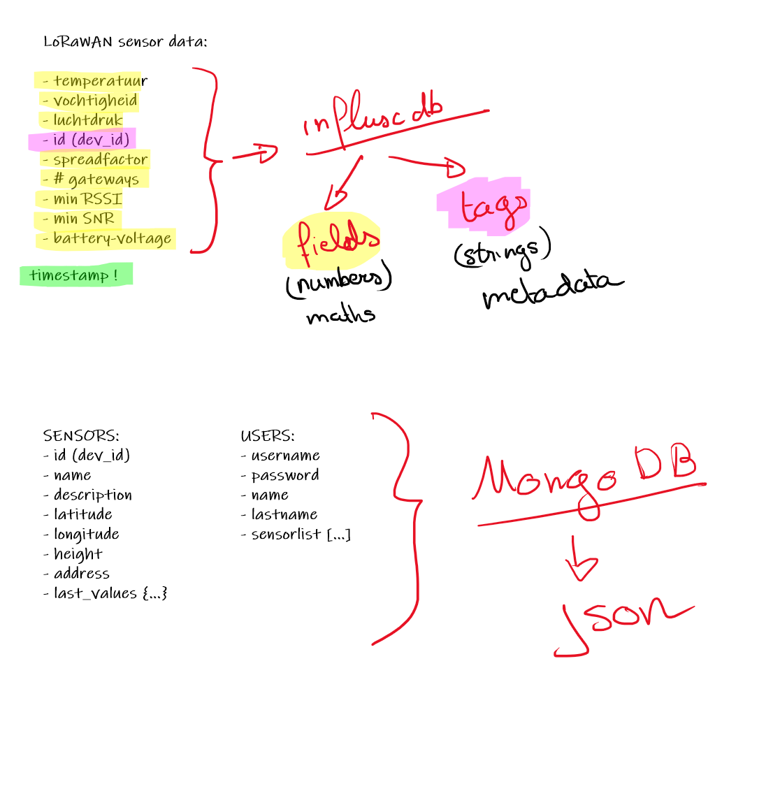
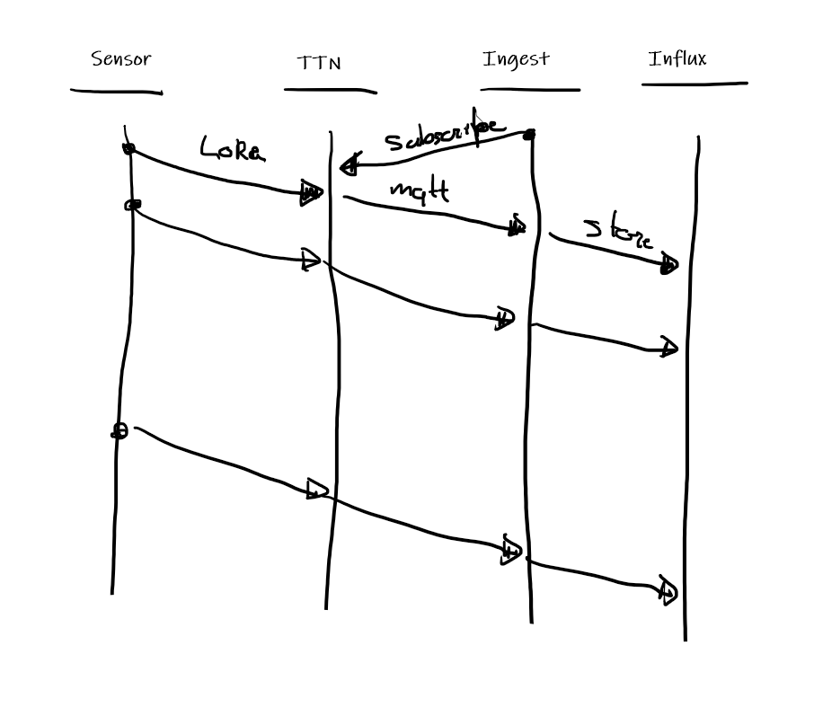
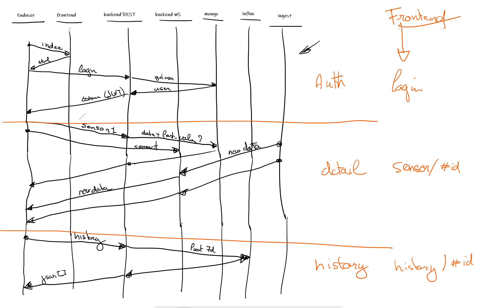

# Project information

## Groepen

* Emma Dossche
* Ben Boydents
* Jarno Thierens

---

* Geylian Lingier
* Arno Vanneste

---

* Maxim Vanden Abeele
* Michiel Decoster

---

* Benjamin D'hondt
* Jibe Defoor

---

* Arno Baecke
* Robin Deleu

## Services

* Frontend
  * [Vue.js](https://vuejs.org)
  * [Vuetify](https://vuetifyjs.com)
* Backend
  * [FeathersJS](https://feathersjs.com/)
* Databases
  * MongoDB
    * [MongoDB](https://www.mongodb.com/mon)
    * [npm package](https://www.npmjs.com/package/mongodb)
    * [Compass](https://www.mongodb.com/products/compass)
  * InfluxDB
    * [InfluxDB](https://www.influxdata.com/)
    * [npm package](https://www.npmjs.com/package/influx)
  * Redis
    * [Redis](https://www.influxdata.com/)
    * [npm package](https://www.npmjs.com/package/tedis)

[jwt](https://jwt.io/)

## TTN gegevens

* mqtt broker: `eu.thethings.network`
* mqtt username: `micro-weather-station`
* mqtt password: zie mail/teams

## Mockup Frontend UI

### Sensor details mockup

### Sensor history mockup

## Architectuur

### Application architecture

### Data models

### Data ingest sequence

### Enduser sequence

